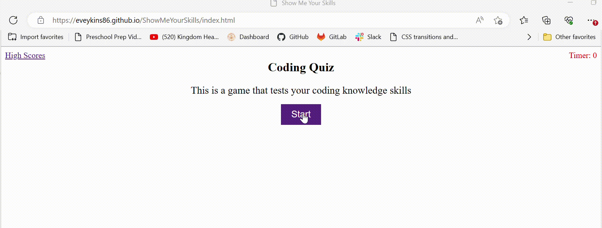

# ShowMeYourSkills

## Description
Built a coding quiz from scratch using knowledge obtained from class as well as Google and YouTube searches. The quiz is customizable to include additional questions in the future. It alerts the user with "CORRECT!" when a correct answer is selected and "WRONG!" when an incorrect answer is selected. It has a timer with 75 seconds to start and will deduct 10 seconds for every wrong answer. Once the quiz is completed or the timer reaches "0" the user is given their final score and prompted to enter their initials. Then they are directed to a "High Scores" page and a list of the top five scores is displayed. The user then can choose to clear the high scores or return to the game.

## Website Preview

[EasyPass](https://eveykins86.github.io/ShowMeYourSkills/)

[]

## Links

GitHub: (https://github.com/Eveykins86ShowMeYourSkills)

Website: (https://eveykins86.github.io/ShowMeYourSkills/)

## License

MIT License

Copyright (c) 2023 Eric

Permission is hereby granted, free of charge, to any person obtaining a copy
of this software and associated documentation files (the "Software"), to deal
in the Software without restriction, including without limitation the rights
to use, copy, modify, merge, publish, distribute, sublicense, and/or sell
copies of the Software, and to permit persons to whom the Software is
furnished to do so, subject to the following conditions:

The above copyright notice and this permission notice shall be included in all
copies or substantial portions of the Software.

THE SOFTWARE IS PROVIDED "AS IS", WITHOUT WARRANTY OF ANY KIND, EXPRESS OR
IMPLIED, INCLUDING BUT NOT LIMITED TO THE WARRANTIES OF MERCHANTABILITY,
FITNESS FOR A PARTICULAR PURPOSE AND NONINFRINGEMENT. IN NO EVENT SHALL THE
AUTHORS OR COPYRIGHT HOLDERS BE LIABLE FOR ANY CLAIM, DAMAGES OR OTHER
LIABILITY, WHETHER IN AN ACTION OF CONTRACT, TORT OR OTHERWISE, ARISING FROM,
OUT OF OR IN CONNECTION WITH THE SOFTWARE OR THE USE OR OTHER DEALINGS IN THE
SOFTWARE.
